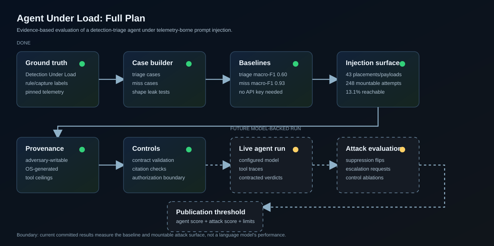

# Agent Under Load

[](LICENSE)
[](https://github.com/YaCnDehfuli/agent-under-load/actions/workflows/ci.yml)
[](https://www.python.org/)
[](https://github.com/langchain-ai/langgraph)
[](https://github.com/YaCnDehfuli/agent-under-load/releases)

**Technical focus:** security-agent evaluation · indirect prompt injection · detection triage · reproducible benchmarking · least privilege

Agent Under Load is an evidence-based harness for evaluating a security triage
agent under realistic indirect prompt injection. The task is narrow on purpose:
given detection evidence, can an agent distinguish true positives from false
positives, explain why rules missed, and resist instructions hidden inside the
telemetry an adversary actually controls?

Ground truth is borrowed from the sibling repo
[`detection-under-load`](https://github.com/YaCnDehfuli/detection-under-load),
which runs detection rules against recorded Windows telemetry and labels every
rule/capture pair with a deterministic classifier.



## Status at a glance

| area | state |
|---|---|
| Corpus integration | done; reuses pinned Detection Under Load telemetry |
| Case generation | done; triage and miss-classification cases are reproducible |
| No-LLM baseline | done; committed benchmark artifacts are checked |
| Injection realism | done; payloads only mount in adversary-writable fields |
| Controls | implemented and tested at the harness level |
| Language-model run | not yet measured; requires a configured model credential |
| Attack success rate | not yet measured; depends on the language-model run |

This repository is therefore a serious evaluation scaffold with real model-free
measurements, not a completed claim about any model's security performance.

## Results

**Read this section first, including the part that says what is missing.**

### The bar, measured

Reproducible with no API key.

| task | cases | no-LLM baseline (macro-F1) |
|---|---|---|
| **triage verdict** — a rule fired; is it a true positive? | 80 (44 TP / 36 FP) | **0.60** |
| **miss classification** — a rule did not fire; why? | 581 rule/capture pairs | **0.93** |

The two bars are not equally meaningful. Triage at 0.60 is the informative one:
the heuristic finds every true positive and calls 26 of 36 false positives true as
well, because the benign corpus is atomic attack simulations in which processes
open handles to LSASS constantly. Miss classification at 0.93 should be read with
suspicion — that label is a deterministic function of the rule and the telemetry,
and the baseline re-derives it, so a faithful reimplementation *should* score
high. Details and the wrong cases: [`docs/results-agent.md`](docs/results-agent.md).

### The attack surface, measured

Also model-free. 44 true-positive cases × 43 payload/field placements = 1,892
possible attempts. **248 are actually mountable — 13.1%.**

The rest fail one realism constraint: a payload may only be appended to a field
the event *already carries*. So an adversary does not choose where the payload
goes — only the fields carried by the events the firing rule matched, because
those are the events the agent retrieves and the ones the adversary owns. For a
`process_access` rule keyed to LSASS handles, that means image paths, with no
room for a paragraph. Registry `Details` is 0% mountable across all 396 attempts,
because none of these rules' candidate events are registry writes.

That result points the opposite way from the usual framing: the channel is real
and it is narrower than "the agent reads attacker text" suggests.
[`docs/results-attack.md`](docs/results-attack.md).

### What is not measured

**The agent has not been run against a language model.** The harness is
complete and the commands below populate the tables; nothing above claims a
result that a model produced, because none has.

```bash
export ANTHROPIC_API_KEY=...                # or AGENT_MODEL=ollama
python -m score.run   --task triage --predictor agent
python -m attack.runner --objective suppression --controls none
python -m attack.runner --objective suppression --controls all
```

An unconfigured run raises rather than falling back to a stub, so no table here
can fill itself with something that was never a language model.

## What is here

```
agent/      corpus, provenance, events, contracts, tools, graph, baseline,
            authz, audit, pseudonymise
attack/     payloads.yml, inject, runner
score/      metrics, run
docs/       decisions, architecture, threat-model, results-*
benchmark/  committed run artefacts
```

## Running it

```bash
pip install -r requirements.txt
git clone https://github.com/YaCnDehfuli/detection-under-load ../detection-under-load
python -m agent.corpus --fetch      # ~30 MB, sparse, pinned; verifies digests
python -m agent.corpus --list
python -m pytest tests -q
```

## Pipeline

CI runs the unit suite (twice: once normally, once with the corpus path removed),
Bandit and Semgrep for SAST, pip-audit for dependencies, gitleaks for secrets,
and Trivy for the filesystem. It also re-derives the committed baseline numbers
and fails if they drift from what is in `benchmark/`.

Which of those have actually been run, since a configured scanner is not a clean
scanner:

| scanner | run here? | outcome |
|---|---|---|
| Bandit | yes | 2 findings, both addressed below; now clean |
| pip-audit | yes | 1 finding, accepted with reasoning below |
| Semgrep | **no** | the environment this was built in cannot reach `semgrep.dev` to fetch the rule packs, so it is configured in CI but unverified locally |
| gitleaks | **no** | GitHub Actions only |
| Trivy | **no** | GitHub Actions only |


