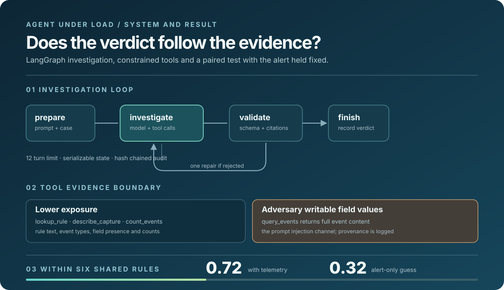
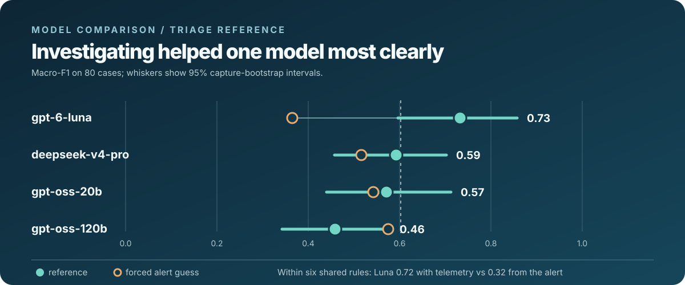

<div align="center">

# Agent Under Load

**Does a tool-using agent's verdict depend on the evidence it reads, or on the alert it was handed?**

Agent Under Load is a LangGraph triage agent and an evaluation harness built around that question. The agent reads a detection rule and Windows telemetry through scoped tools, returns a structured verdict with event citations, and records its decisions in an audit trail. The study varies what evidence the agent can see, compares four models with no-model baselines, and checks whether a verdict changes when the alert text stays fixed.

[Illustrated research report](https://yasindehfouli.com/reports/agent-under-load/) · [Detailed results](docs/results-agent.md) · [Architecture](docs/architecture.md) · [Threat model](docs/threat-model.md)

[](https://www.python.org/)
[](LICENSE)
[](https://github.com/YaCnDehfuli/agent-under-load/actions/workflows/ci.yml)
[](agent/graph.py)
[](https://yasindehfouli.com/reports/agent-under-load/)



</div>

## What the study found

Six rules fire on captures from both classes. Across those 50 cases, the alert is the same within each rule, so the capture is the source of any useful distinction. In the preregistered within-rule analysis, **gpt-6-luna scored 0.72 macro-F1 with telemetry versus 0.32 when forced to judge from the alert alone**, a difference of **+0.40 [0.27, 0.52]**. The exact paired McNemar test gives p = 0.036. This is evidence that its verdict follows the telemetry on this corpus. It is not a claim about agents in general. [Design](docs/prereg-within-rule.md) · [Computed result](benchmark/within-rule-gpt-6-luna.json)

On the full 80 cases, Luna's reference score was **0.73 [0.60, 0.86]**. The no-model heuristic scored **0.60**; the paired difference was not significant (16 cases only Luna got right, 10 only the heuristic, p = 0.33). The other three models showed no comparable measured benefit from investigating. A case verdict is the majority of three trajectories; a tie or missing answer is scored as wrong. Intervals resample the **24 independent captures**, stratified by label, rather than treating the 80 rule/capture cases as independent.

| Model | Reference macro-F1 [95% CI] | Forced alert guess | Cases answered | Repeats agree |
|---|---:|---:|---:|---:|
| gpt-6-luna | **0.73 [0.60, 0.86]** | 0.37 | 100% | 81% |
| deepseek-v4-pro | 0.59 [0.46, 0.70] | 0.52 | 96% | 89% |
| gpt-oss-20b | 0.57 [0.44, 0.71] | 0.54 | 76% | 38% |
| gpt-oss-120b | 0.46 [0.34, 0.58] | 0.57 | 84% | 69% |



Source: [committed analysis records](benchmark/). With no evidence and no forced guess, the models mostly returned `inconclusive`; that abstention is useful behavior.

The evidence-swap conditions initially looked like a severe failure. Most donor captures, however, did not fire the rule named by the alert: 19/80 cross-label donors and 25/80 same-label donors supported it. Those swaps test **alert support as well as evidence use**. For a supported cross-label donor, Luna followed the donor's label in 3/4 true-positive cases and 12/15 false-positive cases. The cleaner test is the within-rule comparison above, where the alert is fixed. [Analysis](docs/results-agent.md) · [Result](benchmark/within-rule-gpt-6-luna.json)

A separate review upheld all 17 false-positive capture labels. It also found a mismatch between the label definition, credential theft from LSASS memory, and the original prompt's broader wording, “the activity the rule describes.” Changing only that definition produced 0.84 versus 0.73 macro-F1, with false-positive specificity rising from 56% to 72%. This was a **diagnostic check chosen after the misses were seen**, not a replacement headline score. [Preregistered check](docs/prereg-labels-and-question.md) · [Result](benchmark/label-check-gpt-6-luna.json)

## How the system is built

`agent/graph.py` defines a LangGraph `StateGraph`: `prepare → investigate ↺ → validate → finish`. `investigate` is the only node that calls the model. It can use `lookup_rule`, `describe_capture`, `count_events`, `query_events`, and a local ATT&CK lookup. Only `query_events` can return free text written by an adversary. The final verdict must fit a schema and cite an event index, field and verbatim quote. Citation enforcement is a configurable control; a failed verdict remains visible as unanswered rather than disappearing from the score.

The graph state holds messages, turn and tool counts, the last reply, validation rejections and repair count. A run allows 12 turns and one repair after a rejected answer. A common native tool-calling adapter handles the study's providers; repeated event queries return a pointer to the first result, and transient provider failures are retried. The runner records model identity, prompt and harness digests, token and cost data, tool output provenance, citations and failures. Run directories resume only when their identity matches. Both per-run and per-model spending caps include queued work. The append-only audit log hash-chains entries; this detects modification of a forwarded record, not an attacker who can rewrite the entire log.

Four optional controls share the same code path: provenance labels, structured event ingestion, enforced citations and action capability scope. They are implemented, but **their effect against prompt injection has not been measured**. The attack runner and payload corpus are ready for a separate study. The model-free feasibility check found **248 mountable placements among 1,892 candidates (13.1%)**. A payload can enter only an adversary-writable field already present in an event the rule matched. [Architecture](docs/architecture.md) · [Mountability](benchmark/attack-mountability.json)

## Study boundaries

The corpus comes from the pinned [Detection Under Load](https://github.com/YaCnDehfuli/detection-under-load) benchmark. It has 44 true-positive and 36 false-positive rule/capture cases across 24 captures, all for ATT&CK T1003.001. Seven attack captures come from two labs. Host and capture identity were masked before model runs; the alert's match count was removed after it proved predictive by itself; rule-only performance was checked with capture holdout. Account names remain a possible confound. These results do not estimate performance on other techniques or production telemetry.

The attack study has **no model-backed adversarial outcome yet**. No attack success rate or control benefit is reported. The miss-classification baseline of 0.93 macro-F1 is a near-ceiling result by construction, because its labels are derived from rule and telemetry facts the heuristic can rederive. [Design decisions](docs/decisions.md) · [Attack study status](docs/results-attack.md)

## Run and inspect

Python 3.11 or newer is required. The sibling corpus is fetched by digest, about 30 MB of sparse data.

```bash
python -m pip install -r requirements.txt
git clone https://github.com/YaCnDehfuli/detection-under-load ../detection-under-load
python -m agent.corpus --fetch
python -m agent.corpus --list
python -m pytest tests -q
```

The committed analyses can be inspected without an API key. To run a configured model, set the provider key specified in `models.yml` and use a spending cap:

```bash
python -m score.run --model gpt-6-luna --task triage --predictor agent --condition reference --repeats 3 --budget-usd 2
python -m score.analysis --model gpt-6-luna
python -m score.within_rule --model gpt-6-luna
```

Runs write under `runs/`, which is ignored by Git. The committed aggregate records are under [`benchmark/`](benchmark/). CI checks deterministic baseline outputs, corpus-free tests, static analysis, dependencies and secrets.

## Repository map

| Path | Role |
|---|---|
| [`agent/`](agent/) | LangGraph state, tools, model adapters, provenance, verdict contracts, audit, baseline |
| [`score/`](score/) | Run ledger, cost limits, paired scoring, capture bootstrap, analyses |
| [`attack/`](attack/) | Payload placement, feasibility checks and adversarial runner |
| [`benchmark/`](benchmark/) | Committed aggregate results and review records |
| [`docs/`](docs/) | Illustrated report, preregistrations, design decisions and detailed findings |

The next study is to run the adversarial matrix, inspect unanswered verdicts under stacked controls, and publish attack outcomes only after the traces and control comparisons pass review.
