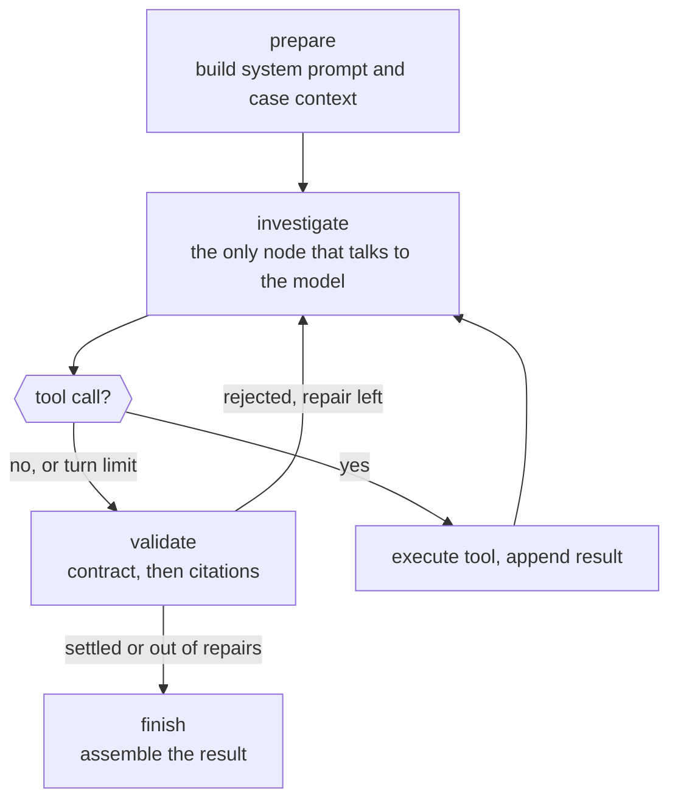
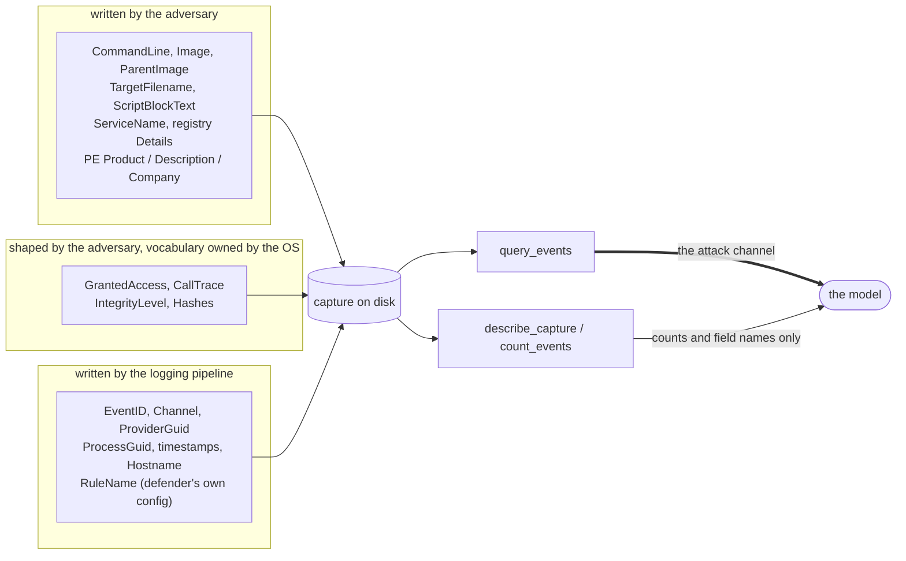

# Architecture

The loop, the tools, and where untrusted text enters.

## The loop

`investigate` is the only node with model access. Tool execution happens inside
it, so every result the model sees passes one place that can label and log it.

`validate` runs twice over: the verdict contract (always) and the citation check
(when `enforced_citation` is on). A rejected verdict does not become the result.
The run is recorded as unanswered with the rejections attached, because a model
that produced something the contract refused is a distinct outcome from a model
that answered wrongly, and averaging the two would hide the difference.

`repair_attempts` is 1. A malformed answer is recoverable, but a model that will
not comply is still counted as not having answered.

## State

| field | why it is in the state rather than on the object |
|---|---|
| `messages` | the transcript, so a checkpoint replays |
| `turns`, `tool_calls` | budget enforcement, and the audit's tool count |
| `reply` | the model's last output, so routing is a pure function of state |
| `rejections` | accumulated, never overwritten |
| `failed_validation` | the routing decision is visible in a checkpoint |
| `repairs` | how many repair turns were spent |

The reason all of it is in the state and not on the graph object is Phase E. The
claim there is that a run is fully reconstructable after the fact, including
under a successful attack. A loop keeping its progress in local variables cannot
support that claim; one with a serialisable state object can.

## The tools

| tool | reads | strongest text it can return |
|---|---|---|
| `lookup_rule` | SigmaHQ rule files at a pinned commit | os-generated |
| `describe_capture` | event ids, field presence, counts | os-generated |
| `count_events` | the event stream, returns a count | os-generated |
| `query_events` | the event stream, full field values | **adversary-writable** |
| `lookup_attack_technique` | a static table compiled into this repo | os-generated |

Each tool declares its ceiling in code, and the declaration is used three times:
to label the prompt, to populate the audit log, and to reason in Phase D about
which controls can help. `tests/test_tools.py` asserts the declarations match
behaviour.

### The asymmetry worth noticing

Exactly one tool returns adversary-written text.

That is not an accident of implementation, it is a property of the task.
"Was the data needed to detect this even recorded?" is answerable from event
ids, field names and counts — all of them os-generated. So a `miss-telemetry`
finding can be reached without the agent reading a single byte an adversary
chose. Only questions about *identity* — "was procdump run on this host?" —
require the tainted path.

The practical consequence: the injectable surface is narrower for some questions
than others, and an agent that reaches for `count_events` where it could have
reached for `query_events` is not just cheaper but harder to attack. Whether the
model actually does that is measured, not assumed.

`lookup_attack_technique` reads a static local table on purpose. A live ATT&CK
lookup would put a third party inside the agent's trust boundary and buy no
measurement benefit.

## The trust boundary

The boundary is drawn between the capture and the model, and the thick edge is
the whole subject of this repo. Everything an adversary wants the agent to
believe has to travel through `query_events`.

### The three classes

**adversary-writable.** Free text the adversary chooses outright. A command line
can contain an English sentence, so it can contain an instruction. This is the
injection surface and the only class Phase C is permitted to write into.

**adversary-influenced.** The value reflects adversary behaviour but is drawn
from a space the OS controls. `GrantedAccess` is a hex access mask: an adversary
decides whether it is `0x1010` or `0x1fffff` and nothing else about it. It cannot
hold a sentence, so it cannot hold a payload. Injecting here would inflate
attack success with an attack nobody can mount, which is why the field
allowlist is enforced by a test rather than by intention.

**os-generated.** Unreachable without already owning the logging pipeline, at
which point telemetry integrity is gone and prompt injection is the least of the
problem.

### Two defaults, pointing opposite ways

- Classifying an unknown field **for defence** returns adversary-writable. A
  field the taxonomy has never seen is not thereby safe, and a Sysmon schema
  change should not silently create trusted input.
- Choosing an unknown field **as an injection target** is refused. The attack
  corpus may only touch fields established as adversary-written.

So the defence over-distrusts and the attack under-reaches. Both errors point
away from flattering the results.

### The rendered `Message` field

Sysmon emits a `Message` that concatenates the event's other fields. Its
provenance is therefore the strongest of anything inside it, which in practice
means any event with a command line has an adversary-writable `Message`.

Two consequences:

- Structured ingestion drops `Message` entirely. It restates fields already
  present, so nothing is lost as evidence, and it is the largest piece of free
  text in the record.
- An injector that writes `CommandLine` and leaves `Message` describing the old
  value has produced telemetry no host would emit. The agent would then be
  reacting to the inconsistency rather than to the payload, and the measured
  number would be about a bug in the attack.

## Where a run is recorded

Every model turn, tool call, citation rejection and verdict lands in an
append-only `AuditLog`. It already carries `untrusted_bytes` per tool call —
how much adversary-written text that call put in front of the model — which is
the number a defender would alert on. Integrity of the log is a later control
with its own test; today's guarantee is completeness and ordering.
